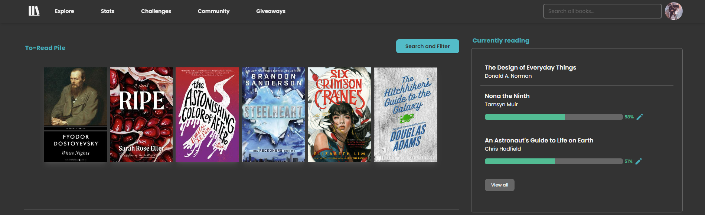
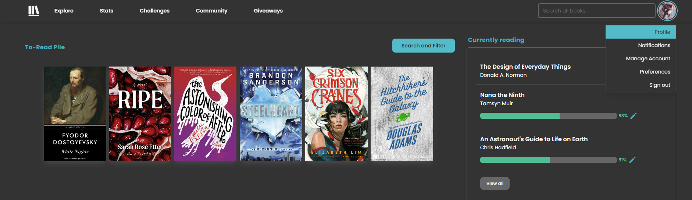
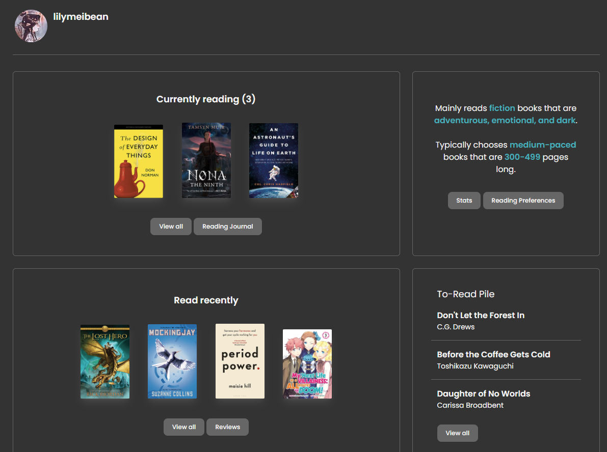

# Affordances and Signifiers Pt. 2: The Design of Everday Things

For context, I'll be writing a tutorial on the Seven Stages of Action and how they can apply to any action that a user might take. The Seven Stages of Action really break down simple interactions with interfaces into step-by-step processes that are mainly split in two sections: "gulf of execution" (plan, specify, perform // this is "doing" the action") and the "gulf of evaluation" (perceive, interpret, compare // this is "understanding" the action) with the "goal" step at the top. In this example, I'll be using the action of viewing your profile on Storygraph (a book-tracking website, similar to Goodreads).

This is where we'll be starting (the home page).

1. The goal (forming a goal)

As mentioned above, our goal is to view our profile on Storygraph, in the next few steps, we will figure out how to execute this and evaluate our actions.

2. Plan (the action, brainstorm how we would get there)

To get to our profile, we could take multiple routes, such as:

- Going to our profile picture and clicking "Profile"
- Editing the URL directly to our profile name
- Going to the "Community" page, finding a book we've updated recently, and clicking on our profile picture

3. Specify (pick an action sequence to use)

The easiest and shortest path to get to our profile is the first option which consists of two actions. First, we must click on or profile image. Second, we must click the button labeled "Profile" from the dropdown.

4. Perform (the action sequence)

Here, I've clicked on my profile image and am hovering over "Profile". After clicking the button, I am brought to a new page. The action has been successfully performed.

5. Perceive (what happened -- the state of the world)

This is what I see after I perform step #4:

What has happened is that I clicked on the "Profile" button and I now see a new page with lots of information. It looks like this page has a username, a list of books this person has read, some genre information, the books that have been read recently, and some books in a "To-Read Pile".

6. Interpret (the perception -- interpret what happened)

Now I must figure out what has happened. I interpreted that after I clicked the "Profile" button, a new page was loaded in that should contain the information of my profile on Storygraph. This seems to be correct since the information on this page reflects my current reading status and my past reading history.

7. Compare (the outcome with the goal)

The goal was to view my profile on Storygraph and I was able to accomplish that via the prior few actions. I can confidently say that my outcome aligns with my initial goal that I had in mind.

I chose this image because it represents a "process" (checklist) where the person is working through the list one step at a time, just like I did in this Tutorial -- going through the different steps of the Seven Stages of Action.

Photo by Glenn Carstens-Peters on Unsplash
Citation: Norman, D. (n.d.). The Design of Everyday Things: Revised and Expanded Edition. Hachette UK.