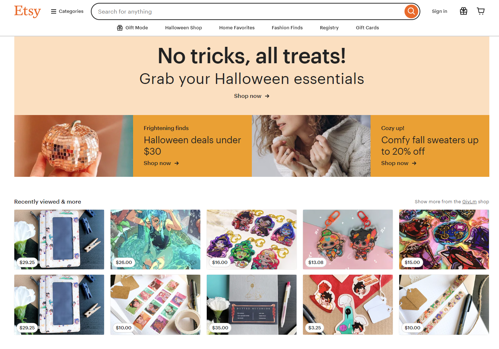
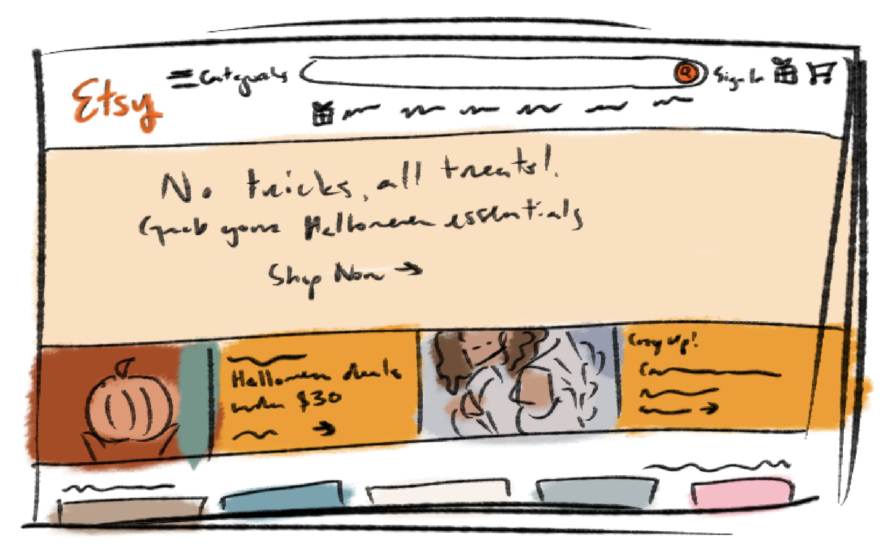
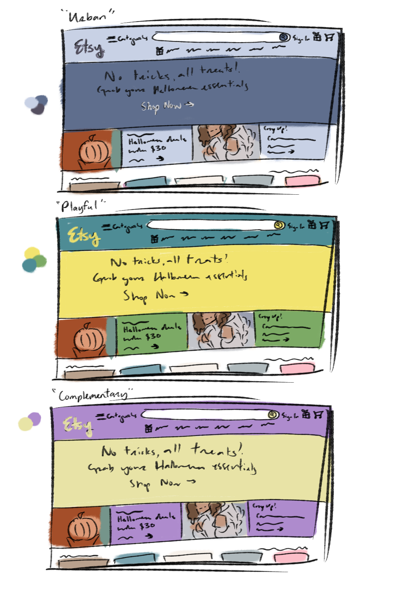

# Color Stories!

Etsy has a very simplistic color scheme, emphasizing the signature orange-and-white combination used in the logo. Interestingly, the page uses some lighter tints of the orange in the top display. It uses an essentially monochromatic color scheme (excluding the product images from artists at the bottom), centered around orange with additions of black and white for other text and backgrounds. The upper display seems to use orange to emphasize “autumn/halloween” energy via its use of a color often associated with the fall season. Additionally, Etsy’s designers might have chosen orange as its main color as orange is often a color associated with communication and high energy, which is what the designers likely wanted to simulate with the site -- creating a platform for buyers to communicate and buy from independent sellers. 

To simplify the colors on the site, I focused mainly on representing the major components above -- where the biggest areas use the signature colors of the site. From this, I wanted to experiment with other color schemes to see what the resulting effect would be and whether or not the site’s bold statement would be as poignant, which are shown below. 

The first color scheme I tested out was based on the “Urban” color scheme in “The Complete Color Harmony”, consisting of cool blue tones. This palette is similar to the original color scheme since it uses three different tints of blue (shown on the left). The monochromatic color scheme helps link all the parts of the site together. I think, compared to the high energy of the initial color scheme, this color scheme gives off a calmer energy, maybe one that isn’t all about “buy, buy buy!” and more “browse, take a seat, look around!” -- which is a good memo as well. However, the blues take away from the autumnal center of the page, making the pumpkin image stand out a bit too much. As such, I don’t think the site would be as poignant with this color scheme -- especially because of its current Halloween theme. For the purposes of this, I'm defining "effective" as the ability for the color scheme to appropriately add to the contents of the page and the overall mood of the application. This blue, while nice and a pleasing color scheme to look upon, isn't exactly "effective" in the sense that it takes away from the focal images of the pumpkin and the girl in the sweater -- which are both giving "autumnal" energy while the blue takes away from that. 

The second color scheme I experimented with is another from the book, a “Playful” color scheme with vibrant, highly pigmented colors. This doesn’t exactly fit one of the harmonious combinations we discussed -- however, it does use a handful of adjacent colors on the color wheel itself. This palette conveys playfulness and creativity -- which could be messages that the site is trying to convey. However, I think that three bright colors is a few too many for one site and makes it hard to figure out what on the site is the most important to focus on. The designers probably would’ve used this color scheme to try and emphasize the “fun” and “creative” nature of Etsy. However, I still think it’s not as effective as the original due to its disregard of focal points, creating a distracting experience. Again, the distracting nature of the chosen bright color scheme takes away focus from the autumnal wording on the page and the page's goal of reminding you to "treat yourself" this autumn by buying something from the site. 

The last color scheme I tried only has two colors and is based on the complementary color combination of yellow and violet. I tried to choose two lighter tints that are a bit desaturated -- however, the combination itself already draws enough attention. I think this color scheme is definitely the most simplistic and makes the mood a little harder to read -- I’d still say it reads as “playful” and almost easter-esque with its pastels. The designers likely would've wanted to make you feel joyful but creative as yellow is a pretty "happy" color and purple is a "mysterious" and "creative" color. However, despiste the potential chemistry of these colors, it doesn't match the site's current autumnal imagery well -- making it, once again a less effective choice than the original. This choice just doesn't seem to have a cohesive motive going on to match the messages of the top section -- the pumpkin imagery clashes with the yellow and purple, almost like Halloween vs Easter imagery -- which doesn't contribute to the goal of the website. Alas, maybe in Easter or spring, this color scheme could be more effective with some tweaking -- but for now it fails to contribute to the "autumnal" vibes of the page. 

Conclusively, the original color scheme of Etsy with its use of different tints of orange is probably the most effective of the ones I created here -- especially given the autumnal season and its association with winter. I think the “Urban” color scheme could work given a different season (winter, mayhaps) -- but the bright orange of Etsy is pretty iconic and recognizable to most creators and small shop enjoyers!

---

Eiseman, L. (2017). The Complete Color Harmony: Expert color information for professional results (Pantone Edition). Rockport Publishers, an imprint of The Quarto Group. 