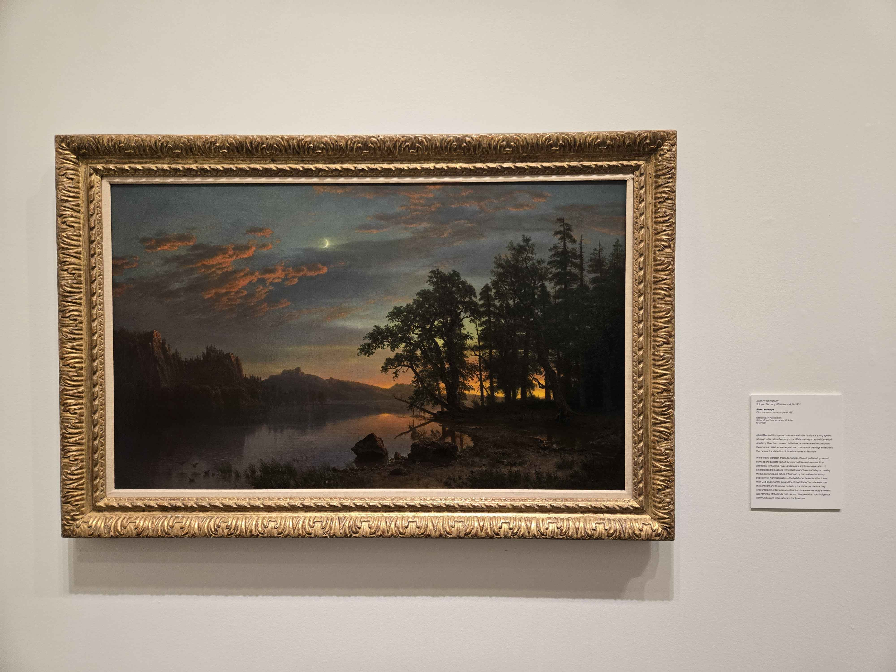
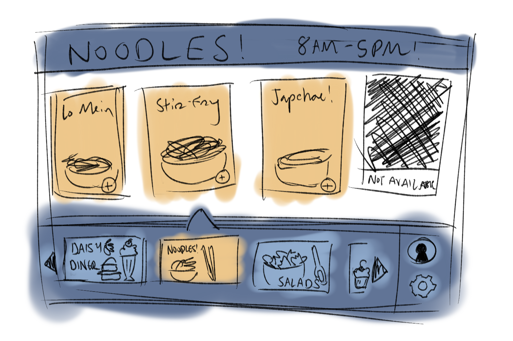

# Finding Inspiration in Art

Recently, I visited a local art museum to find inspiration for UI designs in traditional art. I've always been interested in how people put together traditional compositions, such as oil on canvas and know it'll turn out beautiful -- just as this painting above did. This piece is known as "River Landscape" and was painted by Albert Berstadt in 1867. It's a gorgeous landscape likely inspired by California's Yosemite Valley or the area around Lake Tahoe. Berstadt had been known for painting landscapes in the 1860s and this is no exception. During this time, Manifest Destiny was a popular belief that people abided by -- the idea that it was a God-given destiny to travel west -- and as such, this painting may have been inspired by that notion. Regardless, it remains a beautiful vision of the west and some of its most notable natural wonders. 

One of the techniques employed in the painting selected is the rule of thirds which helps direct and lead attention to particular areas on a piece of art. The goal of an artist is always to draw the eye to important areas, and this is visible in the lower horizontal 1/3 of the page and the rightmost vertical third where the sunset/sunrise is. The orange already draws attention, being a bright color among the dark, but also having the orange along a horizon line placed at the 1/3 point is also very effective. Placing the main focus line at the bottom horizontal 1/3 causes more attention to be focused on the sky vs the ground, continuing the lead the eye where the artist wants it to travel. However, the rule of thirds isn’t a cut-and-dry solution to all photography. It’s important to remember that sometimes just having main aspects “off-center” or balancing a horizon line to be more straight can be enough to help unify the piece and help draw the eye — but it’s not a rule you MUST follow 100% of the time — since sometimes centered photography or photography at the edge of the frame can have a poignant effect as well.

Another technique used in the painting is its use of complementary colors — a color scheme that is often taught at a young age for students to try out in their elementary art classes. But it’s really effective in this painting specifically as it draws and maintains a viewer’s attention on the sunset and along the horizon. Additionally, it draws your attention via the clouds -- which have an orange light shining from beneath toward the crescent moon in the sky. However, the use of the colors alone isn’t enough as vibrant complementary colors can often feel “jarring” or “uncomfortable” when placed too closely together. Copic artist Christopher Kerry, recommends using complementary colors to highlight one of the two colors and not try and emphasize the both of them as that often is ineffective. As such, using a more vibrant orange and more subtle blues in the sky and river allows this painting to be effective in leading the eye toward the orange without the blue being too distracting.

And finally, Berstadt draws attention to focal points by using the contrast of dark and light along the horizon, emphasizing the objects in the background instead of the objects in the foreground. Despite the trees being large (which might make them appear to be the focus on the piece) — having them painted in a dark color keeps attention from focusing solely on them — allowing the viewer to focus more on the orange sunset in the background and the moon in the sky. However, contrast doesn’t only need to be portrayed via different colors — contrast simply refers to having great visual differences between elements, whether that’s size, color, textures, etc. While this painting focuses mainly on the contrast of colors and light (with the sunset and the sun against the dark of the rest of the piece), there are also elements of contrasting size via the large trees and the small moon. Despite the fullness of the trees, we still focus on the moon because of its brightness and size which draws the eye quickly — acting as a very specific and narrow focal point. 

The UI I designed is an online ordering website for a food court and is probably intended to be used either on a computer/iPad or maybe on a “self-ordering” module at the food court itself. I utiilized the rule of thirds with how I organized the content on the page, separating the specific restaurant’s menu bar in the top 2/3 and the different restaurant options in the lower 1/3. This just naturally separates the two main sections of the screen so the user knows where on the screen to interact when performing an action. I also used complementary colors, focusing on highlighting orange and letting the blue act as a “background”/non-focal color throughout. By showing the “clicked”/active items in orange — it naturally brings more attention to them, like how the artist had used orange for the sunset/sunrise which draws the eye to it. And lastly, I used contrast between the available food options (highlighted in orange) and the unavailable options (scratched out in black) to guide users to the available options and keep them away from the unavailable choices. 

Overall, using the techniques employed in the painting gave me a better understanding of how to control the motion of the eye when a user first visits a site. Drawing attention and directing it is one of the most important concepts that a designer must be able to do — and learning from art is a great way to get inspiration on how to accomplish that. 

---

Art featured: River Landscape by Albert Berstadt

References: 
How to use contrast in art in your designs | Adobe Express. Adobe Express. (n.d.). https://www.adobe.com/uk/express/learn/blog/all-about-contrast-in-art 
Kerry, C. (2016, October 15). The secret to using complementary colors effectively. Copic Marker Tutorials |. https://copicmarkertutorials.com/using-complementary-colors-effectively-video/ 
Mansurov, N. (2024, January 28). What is the rule of thirds? A guide for beginners. Photography Life. https://photographylife.com/the-rule-of-thirds 