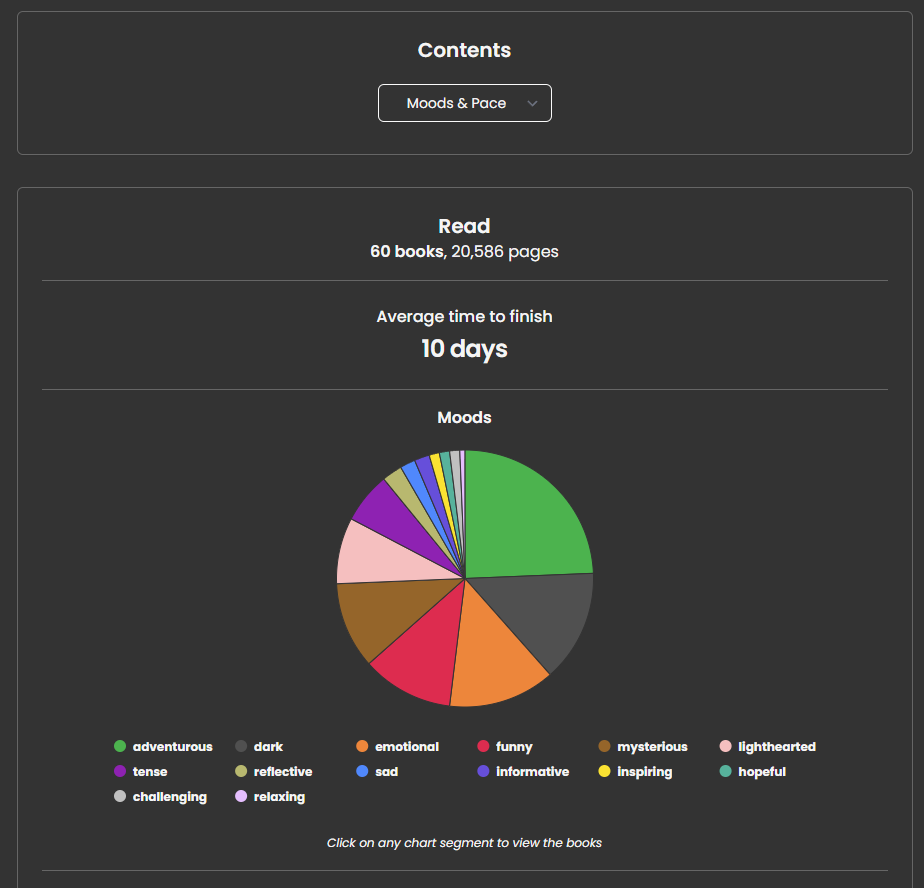

# Schneiderman: Understanding How We Interact with Data

This paper discussed how data can be displayed and how users view and interact with data. The paper breaks both categories into seven data types and seven tasks that users can perform in reference to data, which I'll summarize below. Knowledge of these seven data types and tasks will allow me to better understand the ways users can interact with data and the ways I can display data for them to view. It'll give me a list of interactions to keep in mind if I'm ever developing something data-driven that will need to allow for user analysis.

Seven Data Types:

- 1-dimensional: linear data that is usually read sequentially and in an easy-to-follow manner (e.g. documents, code, lists)
- 2-dimensional: planar or map data that covers part of an area on the "page" (e.g. geographical maps, newspaper layouts)
- 3-dimensional: real-world objects, most of the items in the world are "3d" (e.g. buildings, items with volume)
- temporal: time visualization that shows progress on a project or task (e.g. task managers for project management, timelines)
- multi-dimensional: relational/statistical data that is often organized in a more complex way on multiple plots/clusters (e.g. database visualization)
- tree: hierarchical data that often has a "root/parent" and multiple "leaves/children" that come off a base point (e.g. algorithms, sales data)
- network: relationship-based data that often have multiple connections between "nodes" to show how objects interact (e.g. internet, relationship diagram)

Seven Tasks:

- Overview: getting a bird's eye view of a lot of data, maybe less depth but helps give a "full image" of data from afar
- Zoom: looking into a particular area of a data set to view it in more detail, allow you to still have an understanding of how the data relates to the big picture
- Filter: finding specific pieces of data within a data set to narrow down a query
- Details-on-demand: select an item/group to get more details when needed
- Relate: examining how pieces/sections of data relate to one another or helps you find how two objects connect
- History: being able to view past actions so a user can undo any changes they made to the data easily
- Extract: allows certain segments of data to be separated from the bigger picture and be saved to another location for future reference

To explain some of these concepts via an example, I'll be using the "Stats" page from storygraph.com, a site for keeping track of what books a user has read/wants to read. This page is pretty lengthy overall (there are a lot of graphs) -- so I've chosen this section below to focus on, which includes a couple of data types/displays and ways users can interact with them.

In terms of data types, we have:

1-dimensional: The general statistics (e.g. "Read" and "Average time to finish") which are easy to read and give a quick overview of information
2-dimensional: The pie chart, which shows the breakdown of different genres/"moods" of books I've read this year as parts of a whole

As far as potential user interactions go, a user can:

Details-on-demand: By hovering over the pie chart, the user will get more details on the number of books in that particular category
Relate: By clicking on the "Moods & Pace" drop-down, a user can select one of many ways for a user to view the data (e.g. Length, Fiction v Nonfiction, etc) which will show them the appropriate pie chart with information divided to show the relationship between the books I've read and their select attributes.
Extract: By clicking on a slice of the pie chart, a user will be brought to a page where they can see more details about the book in that specific category (e.g. if they click into the green "adventurous" category, they'll see all the books I've read this year that are "adventurous")

---

Cover Photo: https://unsplash.com/photos/magnifying-glass-near-gray-laptop-computer-d9ILr-dbEdg
Photo by Agence Olloweb on Unsplash -- I chose this image because it shows "Zoom" which is one of the important concepts in this reading as it's one of the seven ways a user can interact with data.
Reading by Ben Shneiderman, Department of Computer Science, University of Maryland