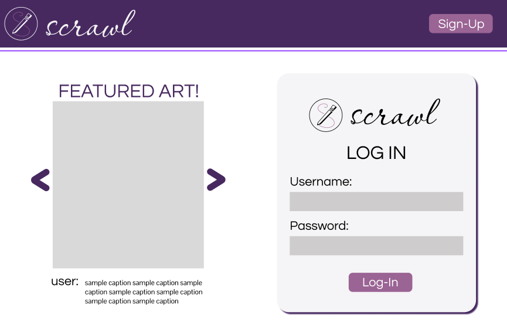

# Projects

## Scrawl

- Scrawl is an art social media platform for artists to share their interests in the arts with others with an intuitive and clean design that's easy to navigate and helps artists gain visibility and grow their audience. I worked on this project in collaboration with Katelyn Breitbarth. 
- Crucial art features, like a commissions page are included to allow for the smooth interaction between an artist and people who want to buy art. 

### Deliverables: 
- [Design System](https://www.figma.com/design/bQ6iy1TsYJAkJRtRYxtTWr/scrawl?node-id=1-7&t=pGjro43KujStXEcw-1)
- [UI Mockups V.1](https://www.figma.com/design/pDaIbX1vtbzajjhYeQxZoB/scrawl-2.0?node-id=0-1&t=TcjtbU9MeBIwwVQV-1)
    - As a note, for the mockups, we had to adjust some of the sizes of features of the original Design System, however, we wanted to keep note of how the design has changed over time so we have them stored in separate locations. 
- [Interactive Prototype](https://www.figma.com/design/doacDGNSpOWhEmGeNBL5Ro/scrawl-3.0?node-id=0-1&t=54vGGaLbBslWIwTa-1)
- [UI Mockups V.2](https://www.figma.com/design/sife6gfHFYzVPmL5Oye0yW/scrawl-5.0?node-id=1-7&t=FF0LF5fU0abdLSje-1)
    - We created this version after taking in user feedback from friends in the art community. 