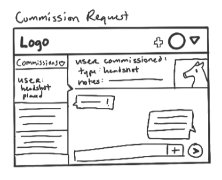
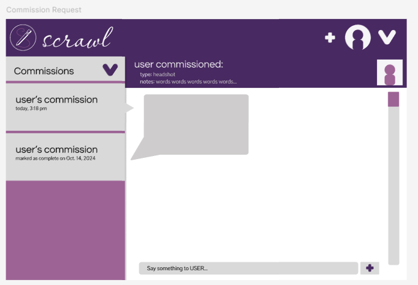

# Scrawl: A Reflection on Designing for Artists

## The Parts We Play

Throughout this project, Katelyn and I worked collaboratively on most design elements and the site's overall layout. We often would meet on Zoom calls to divide the work to be accomplished. In the early phases of the project, I worked on designing the following pages: Log-In, Main Feed, Profile, Commissions, and Commissions Requests. Katelyn was the primary designer behind the DMs, Notifications, Post Creation, and Individual Post pages. However, as we began doing the mock-ups in Figma, we started working on each other’s designed pages in a collaborative effort to improve the overall application. We separately worked on creating different assets of the UI, some notable ones being that Katelyn designed the icons and post format and I worked on the header and dropdown. After all the pages were initially designed, we spent a lot of time working collaboratively to decide what might need adjusting based on our intuition and future testing with colleagues. 

## Brainstorming Ideas

Katelyn and I draw as a hobby, often sharing art and participating in Art Fight, an online art competition. As such, we’ve dabbled in social media platforms such as Instagram and Cara, a site created for artists. However, we’ve found that using these platforms isn’t a seamless experience, and wanted to see what we could do to improve them. Having a site created for artists by artists, with systems customized for artists, such as a Commissions portal for artists to take commissions, would help improve the lives of artists by making it easier to perform the day-to-day tasks of a hobbyist or professional artist. Instead of using a general “one-size-fits-all” solution like Instagram which is meant to appeal to a wide audience, a social media platform tailored solely for artists would allow artists to find and market to the correct audiences. We performed a couple of user interviews to better understand our target audience so we could figure out their pain points and some requirements they’d have for a new art social media platform. We chose to design a desktop application since many digital artists use a computer to connect to art applications and connect their tablet to them, additionally, a desktop application can be accessed via a mobile device or laptop, allowing for the most flexibility for artists. 

The story we wrote in advance of designing the interface followed a full-time employee, Rebecca, who draws in her free time and wants to create a small business out of it by taking commissions. She checks the application on her computer and uploads her art from there so she can build her follower base. She also enjoys using the application to look for art inspiration and scroll to see the works of others. To adhere to Rebecca’s needs, we needed to build a platform that allows users to easily look at the works of others while also being able to attend to their own social media account, specifically so they can take commissions from followers who might be interested in their style and works. We wanted the UI to be intuitive to use and follow many universal traits/aspects of social media sites so that it’s easy to swap to but also offer features that are unique to our application -- such as the Commissions page and Commission Requests portal. 

### Sketches: 

### Initial Draft:

### Figma Mockup 2.0:
* [Click Here to View the Figma Mockup!](https://www.figma.com/design/pDaIbX1vtbzajjhYeQxZoB/scrawl-2.0?node-id=0-1&t=USGzRZgGtw7fFgwu-1)

---

## Deciding on our Design System

Creating the design system was such an open-ended experience for us, one which felt like we were experimenting a lot with potential elements that didn’t quite make a full picture quite yet. It was like having pieces of a puzzle without knowing what the full image would end up looking like. One important aspect we had to decide on initially was color. We initially disagreed on whether the color scheme should be centered around orange, a color often associate with passion, or purple, a color that isn’t naturally occurring and is often the center of many creative ideas and concepts as a result. We ended up choosing purple since it’s a color with a variety of shades that we could work with without making the site seem too “bright” or “playful”. Purple, belonging to the set of cool colors, made for a more relaxing choice and once we started picking out shades, just made sense. 

The name of the site was fully Katelyn’s idea -- we were looking for words that could mean “doodle” or “draw”, since we’re designing an art platform, and at the end of the day, Katelyn mentioned that she recently really liked the word “Scrawl” and we ran with the idea, deciding that if we needed to change it down the line, we could. 

When it came to fonts, we wanted the logo to have a very “script”-esque handwriting to match the title of the site, a “scrawl” of sorts. As such, we looked specifically through those options and then decided to offset the cursive font, we wanted a clean sans serif font that would be easy to read across the page in headings, titles, etc. We ended up picking “Questrial” for its clean but rounded look -- which would match the rest of the rounded edges and corners on the site. Overall, we wanted the site to be creative yet still have a professional air to it for those who might use the site for professional ventures via commissions or creating a brand. 

getting feedback + making changes: 
embed of your prototype BEFORE your user tests + walkthrough of how it works
explain the in-class colleague assessment + the feedback you got -- strengths/weaknesses of prototype + what did you change
user testing procedures + non-identifying details about the testers
themes from the user tests + 5 specific usability issues you committed to changing and how you fixed them
full embed of prototype AFTER the changes

---

## Getting Feedback & Making Changes

For this project, we did two rounds of user testing: one with students, our colleagues, who don’t have a direct relationship to the purpose of our website but are technologically savvy, and one with people who are in the art industry or have engaged with art-specific social media in the past. These two rounds of testing would give us a variety of insights on how the site’s organization could be altered to better suit our target population and clear up any confusions on how to interact with the site. 

Here I’ve attached a version of the prototype made before we performed user tests, aka what Katelyn and I put together after our initial round of user interviews before we began designing. 

* [Scrawl Pre-User Tests](https://www.figma.com/design/doacDGNSpOWhEmGeNBL5Ro/scrawl-3.0?node-id=0-1&t=TffvE2URkA2bWv1p-1)

During our first round of user testing with colleagues, we found that the strength of the application came in its actual appearance -- the colors we used were cohesive and it had a similar layout and functionality to social media they had used before. However, the difficulty came when we asked them to perform an art-specific task -- to check on commission requests. We quickly learned that the navigation to the Commissions page wasn’t intuitive, as people would navigate to it, assuming that the “Commissions Requests” would be located there as well. However, since we had hidden the Commissions Requests under the “DMs” page, it was very difficult to find. Katelyn and I decided it would be better to have multiple ways to navigate to the commission-specific requests, and therefore allowed it to be accessible via the Commissions page as well. 

When it came to testing users, we chose a handful of people with artistic experience, two of which don’t use art social media but enjoy drawing, and two who engage with art social media a lot -- one who explores it professionally (takes commissions) and one who just posts for fun. We wanted to choose a variety of users since art social media should be a place where artists of any skill, background, or intended usage are able to view or post their art freely. We created a script we could read to each tester so that we were giving them the same context and experience before asking them to perform two tasks. Some general themes we found in this round of tests were that the navigation improved significantly from the last set of tests, but some icons needed further clarification and important artist-specific needs that needed to be included (e.g. search bar). 

From these tests, we found the below usability problems that we committed to changing: 
* Lack of logout button.
* Clarify the post icon to separate it from the profile icon.
* Switch from a dropdown arrow to a hamburger icon to follow popular conventions.
* Allow users to click the “exclamation point” in the DMs dropdown to navigate to that page.
* Add a Search bar to the main feed to allow users to find specific pieces of art.

We chose these changes specifically because they were crucial to the site’s functionality or would add clarification where icons and symbols were not clear. This would improve the overall functionality of the site and allow people to navigate more comfortably on the site with less hesitation. We addressed each of these issues as follows: 
* We added a logout option to the dropdown menu which can be accessed from every page.
* We added a circle around the post icon. 
* We updated the dropdown to be a hamburger icon on every page.
* We made the “exclamation point” clickable wherever it appears.
* We added a search bar to the header of the main feed so that users can browse specific art.

After adding these changes, we were a lot more confident in our site and its usability overall. Below, I’ve attached the final version of the application made after the two rounds of user tests (colleagues, art users). 

* [Scrawl Post-User Tests](https://www.figma.com/design/sife6gfHFYzVPmL5Oye0yW/scrawl-5.0?t=TffvE2URkA2bWv1p-1)

---

## Reflection on Scrawl’s Values

Early on in the process of designing Scrawl, we were asked what the main values of the site would be and how we’d achieve those values. We chose “Creativity” and “Harmony” to emphasize the artistic nature of the site and the desire to help artists build a strong online community with other artists. As a result of social media platforms allowing AI to scrape from their sites, artists have been frazzled by the changes and forced to find other platforms that will protect their works, including Cara and BlueSky. However, rebuilding an account from scratch is difficult, and even if some followers follow you to a new platform, others may not which may cause you to lose support. As such, we wanted Scrawl to become a new safe space for artists to be creative and share their works with like-minded people. I think we were successful at achieving both of these values through our designs.

Creativity can be seen via the main feed and the user’s ability to customize their Commissions page to fit their needs. Instead of being limited to a couple of “set-in-stone” options, Scrawl allows users to tailor the price and options to fit what the user wants to offer. Additionally, creativity is inherently part of an art website, and allowing artists to post their works and have them seen by others is a core value and goal of Scrawl as a whole. Additionally, the Explore page would be a place for artists to be able to see the works of others and gain inspiration, a core element of creativity. 

The value of community can be seen via the Main Feed and Explore pages, DMs, and the ability to comment on posts. Our goal is to create many opportunities for artists to engage with one another via DMs if they want to discuss certain art pieces or ideas and the comment section to allow artists to support one another. Additionally, the Main Feed and Explore pages allow users to find new artists to support and connect with in an easy-to-use manner. All-in-all, the platform has many opportunities for users to find other artists to talk and connect with, allowing them to create a community they can share their art with. 
